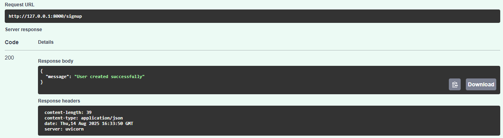
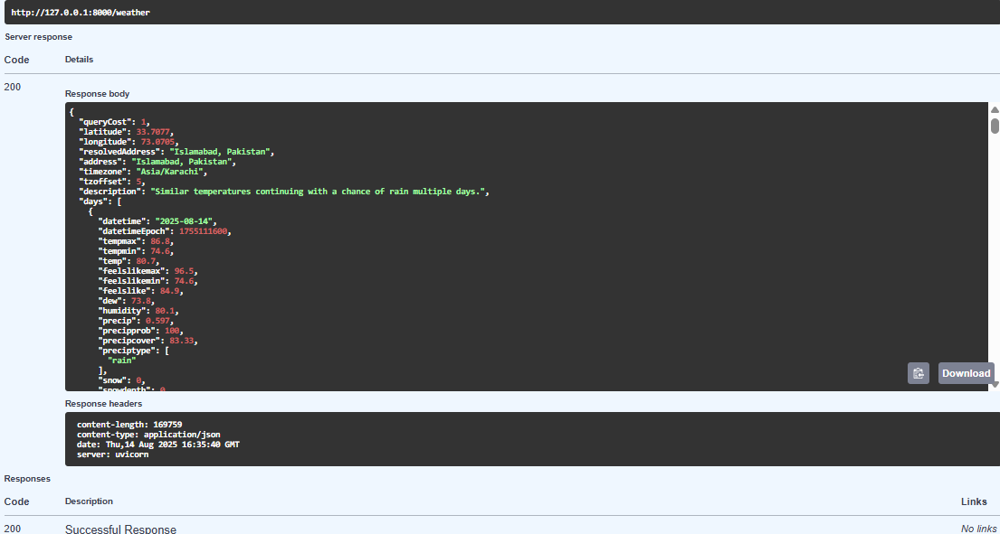
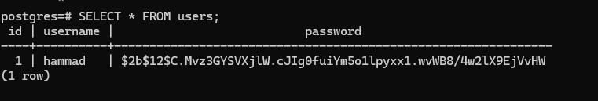

# CPlus-Soft-Weather-Task
- FASTAPI
- PostgreSQL
- Weather API

This API allows you to:
- **Sign up users** (store in PostgreSQL table `Cplus`)
- **Log in users**
- **Fetch weather forecast** for a given city using OpenWeather API

---

## 📂 Project Structure

```
Cplus_Task/
│── app/
│   │── __init__.py
│   │── database.py
│   │── main.py
│   │── models.py
│   │── schemas.py
│   │── weather.py
│── config.json
│── requirements.txt
│── README.md
│── images/
│    │── signup-response.png
│    │── login-response.png
│    │── weather-response.png
```

---

## ⚙️ Requirements

- Python 3.9+
- PostgreSQL
- OpenWeather API key

---

## 📦 Installation


2️⃣ **Create a virtual environment**

```bash
python -m venv env
source env/bin/activate  # Mac/Linux
env\Scripts\activate     # Windows
```

3️⃣ **Install dependencies**

```bash
pip install -r requirements.txt
```

4️⃣ **Setup config.json**
Edit `config.json`:

```json
{
  "database": {
    "host": "localhost",
    "port": 5432,
    "user": "postgres",
    "password": "s*********2",
    "dbname": "postgres"
  },
    "jwt": {
    "secret_key": "*********************",
    "algorithm": "HS256",
    "access_token_expires_minutes": 60
  }
}
```

5️⃣ **Optional: Set API key in `.env`**

API Fetch Link:
WEATHER_URL = "https://weather.visualcrossing.com/VisualCrossingWebServices/rest/services/timeline/Islamabad%2C%20Pakistan?unitGroup=us&key={YOUR_API_KEY}&contentType=json"


6️⃣ **Create PostgreSQL database**

```sql
CREATE DATABASE "postgres";
```

7️⃣ **Run the app**

```bash
uvicorn app.main:app --reload
```

---

## 📄 API Endpoints

---

### 1. **Sign Up**

**POST** `/users/`

#### Request Body

```json
{
  "username": "hammad",
  "password": "hammad123"
}
```

#### Response Example (Image)



#### cURL

```bash
curl -X 'POST' \
  'http://127.0.0.1:8000/signup' \
  -H 'accept: application/json' \
  -H 'Content-Type: application/json' \
  -d '{
  "username": "hammad",
  "password": "hammad123"
}'
```

---

### 2. **Login**

**POST** `/login/`

#### Request Body

```json
{
  "email": "hammad",
  "password": "hammad123"
}
```

#### Response Example (Image)


#### cURL

```bash
curl -X 'POST' \
  'http://127.0.0.1:8000/login' \
  -H 'accept: application/json' \
  -H 'Content-Type: application/json' \
  -d '{
  "username": "hammad",
  "password": "hammad123"
}'
```

---

### 3. **Weather Forecast**

**GET** `/weather/{city}`

#### Example Request

```bash
curl -X 'GET' \
  'http://127.0.0.1:8000/weather/islamabad' \
  -H 'accept: application/json'
```

#### Response Example 



---

#### Database Table:



## 🚀 Running Tests

Once server is running:

* Visit Swagger UI: [http://127.0.0.1:8000/docs](http://127.0.0.1:8000/docs)
* Try endpoints directly from the browser

---

